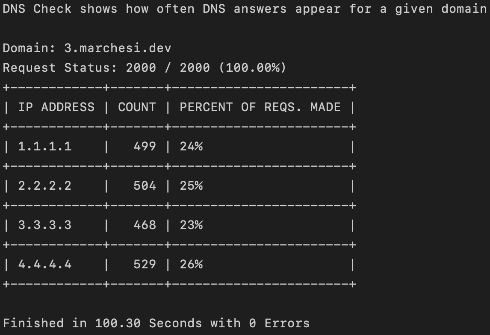

# DNS Check
A simple tool to measure DNS response frequency.

---

# Quick Start

### Installation
DNS Check is platform agnostic and can be installed on any system with the following command:
```bash
CGO_ENABLED=0 go install github.com/wmarchesi123/dns-check
```

### Usage

To run DNS Check, use the following command:
```bash
dns-check <domain> <number of requests>
```

Example:
```bash
dns-check google.com 1000
```

Example run:


