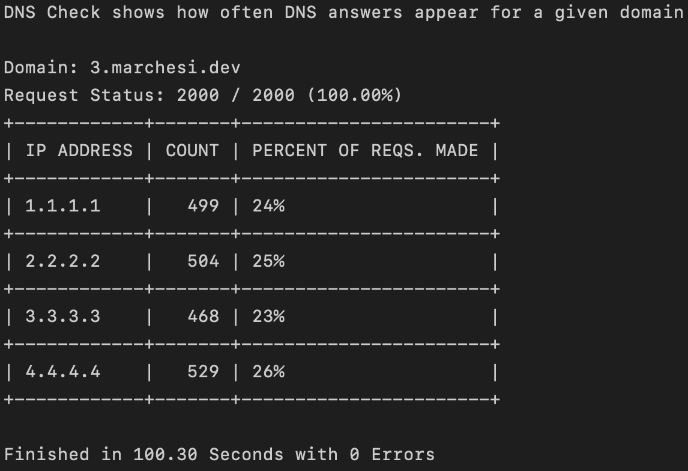

# DNS Check
A simple tool to measure DNS response frequency.

---

# Quick Start

### Installation
DNS Check is platform agnostic and can be installed on any system with the following command:
```bash
CGO_ENABLED=0 go install github.com/wmarchesi123/dns-check@latest
```

### Usage

To run DNS Check, use the following command:
```bash
dns-check <domain> <number of requests>
```

Example:
```bash
dns-check google.com 1000
```

Example run:


---

[](https://github.com/wmarchesi123/dns-check/releases/latest) [](https://goreportcard.com/report/github.com/wmarchesi123/dns-check) [](https://pkg.go.dev/github.com/wmarchesi123/dns-check) 

